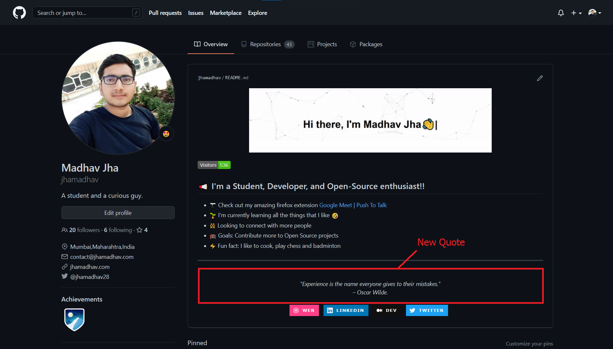

# Quote workflow

<p align="center">
<a target="_blank" href="https://jhamadhav.com/" alt="Quote demo"></img></a>
</p>

## Quote sample
<!-- QUOTE:START -->
<!-- QUOTE:END -->

## How to use

1. Star this repo 😛
1. Go to your repository
1. Add the following section to your **README.md** file. Just make sure that you use `<!-- QUOTE:START --><!-- QUOTE:END -->` in your readme. The workflow will replace this comment with the amazing quotes: 
    ```markdown
    <!-- QUOTE:START -->
    <!-- QUOTE:END -->
    ```
1. Create a folder named `.github` and create a `workflows` folder inside it, if it doesn't exist.
1. Create a new file named `quote-workflow.yml` with the following contents inside the workflows folder:
```yaml
name: Quote workflow
on:
  schedule: # Run workflow automatically
    - cron: '0 * * * *' # Runs every hour, on the hour
  workflow_dispatch: # Run workflow manually (without waiting for the cron to be called), through the Github Actions Workflow page directly

jobs:
  update-readme-with-quote:
    name: Update this repo's README with amazing quotes
    runs-on: ubuntu-latest
    steps:
       - name: Setup node 14
       - uses: actions/checkout@v2
       - uses: actions/setup-node@v2
         with:
            node-version: 14.x
       - name: pull script to get quote
       - uses: jhamadhav/quote-workflow@master
       - name: Commit and push changes
         run: |
            git config --global user.name "jhamadhav"
            git config --global user.email "contact@jhamadhav.com"
            git add -A
            git commit -m "New Quote update"
            git push
```
1. Commit and wait for it to run automatically or you can also trigger it manually to see the result instantly. To trigger the workflow manually.

## Bugs

If you are experiencing any bugs, don’t forget to open a [new issue](https://github.com/jhamadhav/quote-workflow/issues/new).

## Liked it?

Hope you liked this project, don't forget to give it a star ⭐.
